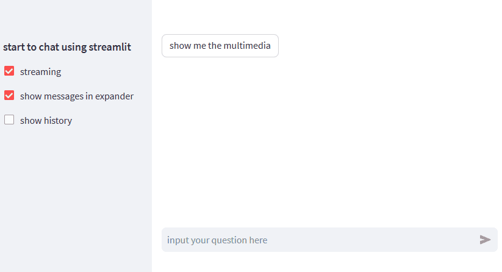
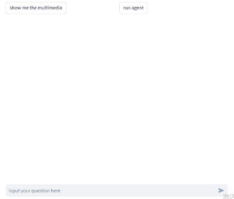

# Attention!

Since version 1.24.0 streamlit provides official elements to [build conversational apps](https://docs.streamlit.io/knowledge-base/tutorials/build-conversational-apps).

The new elements are more flexible, extensible and better supported, I would suggest to use them. 

However, streamlit>=1.23 requires protobuf>=4 when some package requires protobuf<=3. In this condition you can use this package(<1.0.0) with streamlit<=1.22 as alternative. They are all simple to render text messages.

This package(>=1.0.0) will focus on wrapper of official chat elements to make chat with LLMs more convenient.

# Chatbox component for streamlit

A Streamlit component to show chat messages.
It's basiclly a wrapper of streamlit officeial elements including the chat elemnts.

- demo


- demo agent


## Features

- support streaming output.
- support markdown/image/video/audio messages, and all streamlit elements could be supported by customized `OutputElement`.
- output multiple messages at once, and make them collapsable.
- export & import chat histories

This make it easy to chat with langchain LLMs in streamlit.

Goto [webui](https://github.com/chatchat-space/Langchain-Chatchat/blob/master/webui_pages/dialogue/dialogue.py) of [langchain-chatchat](https://github.com/chatchat-space/Langchain-Chatchat) to see the actual application.


## Install

just `pip install -U streamlit-chatbox`

## Usage examples

```python
import streamlit as st
from streamlit_chatbox import *
import time
import simplejson as json


llm = FakeLLM()
chat_box = ChatBox()


with st.sidebar:
    st.subheader('start to chat using streamlit')
    streaming = st.checkbox('streaming', True)
    in_expander = st.checkbox('show messages in expander', True)
    show_history = st.checkbox('show history', False)

    st.divider()

    btns = st.container()

    file = st.file_uploader(
        "chat history json",
        type=["json"]
    )

    if st.button("Load Json") and file:
        data = json.load(file)
        chat_box.from_dict(data)


chat_box.init_session()
chat_box.output_messages()

if query := st.chat_input('input your question here'):
    chat_box.user_say(query)
    if streaming:
        generator = llm.chat_stream(query)
        elements = chat_box.ai_say(
            [
                # you can use string for Markdown output if no other parameters provided
                Markdown("thinking", in_expander=in_expander,
                         expanded=True, title="answer"),
                Markdown("", in_expander=in_expander, title="references"),
            ]
        )
        time.sleep(1)
        text = ""
        for x, docs in generator:
            text += x
            chat_box.update_msg(text, element_index=0, streaming=True)
        # update the element without focus
        chat_box.update_msg(text, element_index=0, streaming=False, state="complete")
        chat_box.update_msg("\n\n".join(docs), element_index=1, streaming=False, state="complete")
    else:
        text, docs = llm.chat(query)
        chat_box.ai_say(
            [
                Markdown(text, in_expander=in_expander,
                         expanded=True, title="answer"),
                Markdown("\n\n".join(docs), in_expander=in_expander,
                         title="references"),
            ]
        )

cols = st.columns(2)
if cols[0].button('show me the multimedia'):
    chat_box.ai_say(Image(
        'https://tse4-mm.cn.bing.net/th/id/OIP-C.cy76ifbr2oQPMEs2H82D-QHaEv?w=284&h=181&c=7&r=0&o=5&dpr=1.5&pid=1.7'))
    time.sleep(0.5)
    chat_box.ai_say(
        Video('https://sample-videos.com/video123/mp4/720/big_buck_bunny_720p_1mb.mp4'))
    time.sleep(0.5)
    chat_box.ai_say(
        Audio('https://sample-videos.com/video123/mp4/720/big_buck_bunny_720p_1mb.mp4'))

if cols[1].button('run agent'):
    chat_box.user_say('run agent')
    agent = FakeAgent()
    text = ""

    # streaming:
    chat_box.ai_say() # generate a blank placeholder to render messages
    for d in agent.run_stream():
        if d["type"] == "complete":
            chat_box.update_msg(expanded=False, state="complete")
            chat_box.insert_msg(d["llm_output"])
            break

        if d["status"] == 1:
            chat_box.update_msg(expanded=False, state="complete")
            text = ""
            chat_box.insert_msg(Markdown(text, title=d["text"], in_expander=True, expanded=True))
        elif d["status"] == 2:
            text += d["llm_output"]
            chat_box.update_msg(text, streaming=True)
        else:
            chat_box.update_msg(text, streaming=False)

btns.download_button(
    "Export Markdown",
    "".join(chat_box.export2md()),
    file_name=f"chat_history.md",
    mime="text/markdown",
)

btns.download_button(
    "Export Json",
    chat_box.to_json(),
    file_name="chat_history.json",
    mime="text/json",
)

if btns.button("clear history"):
    chat_box.init_session(clear=True)
    st.experimental_rerun()


if show_history:
    st.write(chat_box.history)
```

## Todos

- [x] wrapper of official chat elements
- [ ] input messages: (this depends on the official st.chat_input improvement by #7069)
	- [x] TEXT
	- [ ] IMAGE
		- [ ] file upload
		- [ ] paste from clipboard(streamlit_bokeh_events)
	- [ ] VIDEO
		- [ ] file upload
	- [ ] AUDIO
		- [ ] file upload
		- [ ] audio-recorder-streamlit

- [x] output message types:
	- [x] Text/Markdown/Image/Audio/Video
	- [x] any other output types supported by streamlit

- [ ] improve output performance
	- [x] streaming output message
	- [x] show message in expander
	- [ ] style the output message
    - [x] feedback by user

- [x] export & import chat history
	- [x] export to markdown
	- [x] export to json
    - [x] import json

- [x] support output of langchain' Agent.
